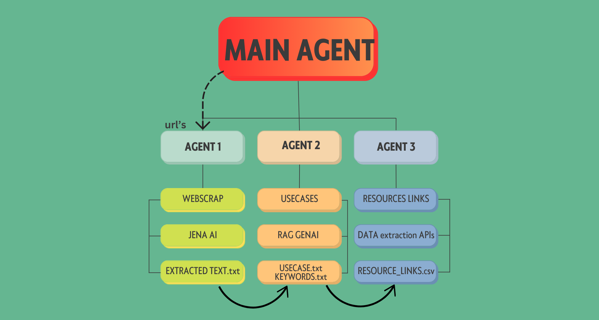

---

# **Multi-Agent Automation System**

 

---

## **Project Overview**

The **Multi-Agent Automation System** is a modular Python-based system designed to automate web scraping, AI-powered use case generation, and Kaggle dataset collection. The system utilizes three independent agents, each performing a specific task:

1. **Agent 1**: Web Scraping - Extracts text from websites based on a list of keywords.
2. **Agent 2**: Use Case Generator - Uses AI to generate relevant use cases from the extracted text.
3. **Agent 3**: Resource Collector - Uses the Kaggle API to search and download datasets related to the use cases.

The system is built using the Retrieval-Augmented Generation (RAG) framework for data retrieval and processing, LangChain for handling the flow of data between agents, and the Gemini AI API for generating AI-based outputs.

Technologies Used:

**RAG** (Retrieval-Augmented Generation): This system uses RAG for enhancing the quality of AI generation by retrieving relevant data before processing.

**LangChain:** Utilized for building the system's workflow, making it possible to manage agents and tasks seamlessly.

**Gemini AI API:** Used for generating use cases and text processing tasks via an API key.

By leveraging these powerful tools, this multi-agent system can efficiently scrape websites, generate useful insights, and retrieve datasets for further analysis.

The system is coordinated by a central controller script (`main_agent.py`), and it stores the output in various files within the `data/` directory.

---

## **Table of Contents**

- [Project Overview](#project-overview)
- [Architecture Diagram](#architecture-diagram)
- [Data Storage Files](#data-storage-files)
- [Sample Input and Output](#sample-input-and-output)
- [Execution Instructions](#execution-instructions)
- [License](#license)


---

## **Architecture Diagram**

Below is the architecture diagram of the system:

```
                          +-------------------------------+
                          |       Main Controller        |
                          |         main_agent.py        |
                          +-------------------------------+
                                     |     |     |
        -----------------------------+     |     +--------------------------------
        |                                  |                                  |
+------------------------+    +------------------------+    +------------------------+
|   Agent 1: Web Scraper |    | Agent 2: Use Case Gen  |    | Agent 3: Resource Coll |
|    agent1_webscrap.py  |    |  agent2_usecase.py     |    |  agent3_resource.py    |
+------------------------+    +------------------------+    +------------------------+
        |                         |                         |
        |                         |                         |
+------------------------+   +------------------------+   +------------------------+
|   Extracted Text File  |   |  Generated Use Cases   |   |   Downloaded Datasets  |
|   extracted_text.txt   |   | use_cases.txt          |   |   resource_links.csv   |
+------------------------+   +------------------------+   +------------------------+
                                     |
                          +------------------------+
                          |                        |
                          |   keywords.txt         |
                          +------------------------+
```

---

## **Data Storage Files**

The following files are created by the system to store the output:

| **File Name**         | **Data Type**   | **Description**            |
|----------------------|------------------|----------------------------|
| `extracted_text.txt` | Plain Text       | Extracted text from web pages based on keywords. |
| `use_cases.txt`      | Plain Text       | Generated use cases using AI (from extracted text). |
| `keywords.txt`       | Plain Text       | List of keywords for web scraping. |
| `resource_links.csv` | CSV              | Resource links related to Kaggle datasets. |


---

## **Sample Input and Output**

### **Sample Input:(if needed)**


### **Indian Companies by Industry**

| **Company Name**             | **Industry**       | **Segment**                                                                 | **Wikipedia Link**                                                                 |
|-------------------------------|--------------------|-----------------------------------------------------------------------------|------------------------------------------------------------------------------------|
| [Tata Motors](https://www.tatamotors.com)           | Automotive         | Manufacturing of commercial and passenger vehicles                          | [Visit Wikipedia](https://en.wikipedia.org/wiki/Tata_Motors)                      |
| [Mahindra & Mahindra](https://www.mahindra.com)     | Automotive         | Manufacturing of SUVs, tractors, and commercial vehicles                    | [Visit Wikipedia](https://en.wikipedia.org/wiki/Mahindra_%26_Mahindra)            |
| [Bajaj Auto](https://www.bajajauto.com)            | Automotive         | Manufacturing of motorcycles, scooters, and three-wheelers                 | [Visit Wikipedia](https://en.wikipedia.org/wiki/Bajaj_Auto)                       |
| [Larsen & Toubro (L&T)](https://www.larsentoubro.com) | Construction       | Engineering, construction, and infrastructure development                   | [Visit Wikipedia](https://en.wikipedia.org/wiki/Larsen_%26_Toubro)                |
| [DLF Limited](https://www.dlf.in)                  | Real Estate        | Residential and commercial property development                             | [Visit Wikipedia](https://en.wikipedia.org/wiki/DLF_(company))                    |
| [Godrej Properties](https://www.godrejproperties.com)   | Real Estate        | Residential and commercial real estate projects                             | [Visit Wikipedia](https://en.wikipedia.org/wiki/Godrej_Group)                     |
| [Reliance Industries](https://www.ril.com)         | Energy             | Oil refining, petrochemicals, and renewable energy                          | [Visit Wikipedia](https://en.wikipedia.org/wiki/Reliance_Industries)              |
| [Indian Oil Corporation](https://iocl.com)         | Energy             | Oil refining, distribution, and marketing                                   | [Visit Wikipedia](https://en.wikipedia.org/wiki/Indian_Oil_Corporation)           |
| [NTPC Limited](https://www.ntpc.co.in)             | Energy             | Power generation and renewable energy                                       | [Visit Wikipedia](https://en.wikipedia.org/wiki/NTPC_Limited)                     |
| [Infosys](https://www.infosys.com)                 | IT Services        | Software development, consulting, and IT outsourcing                        | [Visit Wikipedia](https://en.wikipedia.org/wiki/Infosys)                          |
| [TCS (Tata Consultancy Services)](https://www.tcs.com)  | IT Services        | IT services, consulting, and business solutions                             | [Visit Wikipedia](https://en.wikipedia.org/wiki/Tata_Consultancy_Services)        |
| [Wipro](https://www.wipro.com)                     | IT Services        | IT services, consulting, and digital transformation                         | [Visit Wikipedia](https://en.wikipedia.org/wiki/Wipro)                            |
| [HDFC Bank](https://www.hdfcbank.com)              | Finance            | Retail banking, corporate banking, and loans                                | [Visit Wikipedia](https://en.wikipedia.org/wiki/HDFC_Bank)                        |
| [ICICI Bank](https://www.icicibank.com)            | Finance            | Retail banking, corporate banking, insurance                                | [Visit Wikipedia](https://en.wikipedia.org/wiki/ICICI_Bank)                       |
| [Bajaj Finserv](https://www.bajajfinserv.in)       | Finance            | Financial services including lending, insurance, and wealth management      | [Visit Wikipedia](https://en.wikipedia.org/wiki/Bajaj_Finserv)                    |
| [Apollo Hospitals](https://www.apollohospitals.com)  | Healthcare         | Multispecialty hospitals and healthcare services                            | [Visit Wikipedia](https://en.wikipedia.org/wiki/Apollo_Hospitals)                 |
| [Fortis Healthcare](https://www.fortishealthcare.com)  | Healthcare         | Multispecialty hospitals and diagnostics                                    | [Visit Wikipedia](https://en.wikipedia.org/wiki/Fortis_Healthcare)                |
| [Dr. Reddy's Laboratories](https://www.drreddys.com)| Pharmaceuticals    | Manufacturing of generic drugs, active pharmaceutical ingredients (APIs)    | [Visit Wikipedia](https://en.wikipedia.org/wiki/Dr._Reddy%27s_Laboratories)       |
| [Cipla](https://www.cipla.com/)                    | Pharmaceuticals    | Manufacturing of generic drugs and respiratory care products                | [Visit Wikipedia](https://en.wikipedia.org/wiki/Cipla)                            |
| [Flipkart](https://www.flipkart.com/)              | E-commerce/Retail  | Online retail platform for electronics, fashion, groceries, etc.           | [Visit Wikipedia](https://en.wikipedia.org/wiki/Flipkart)                         |

---

### **Education Companies That Require GenAI**

| **Company Name**             | **Industry**       | **Segment**                                                                                     | **Wikipedia Link**                                                                 |
|-------------------------------|--------------------|-------------------------------------------------------------------------------------------------|------------------------------------------------------------------------------------|
| [BYJU'S](https://byjus.com/)                  | Education          | Online learning platform for K-12 students                                                      | [Visit Wikipedia](https://en.wikipedia.org/wiki/Byju%27s)                          |
| [Vedantu](https://www.vedantu.com/)               | Education          | Online tutoring platform for school students                                                    | Not available on Wikipedia                                                        |
| [Unacademy](https://unacademy.com/)              | Education          | Online education platform for competitive exams                                                 | Not available on Wikipedia                                                        |
| [Simplilearn](https://www.simplilearn.com/)       | Education          | Online certification training courses in technology and business                                | Not available on Wikipedia                                                        |
| [Toppr (Acquired by BYJU'S)](https://www.toppr.com/)   | Education          | Online learning app for K-12 students                                                           | Not available on Wikipedia                                                        |

---


### **Sample Output:**

**`extracted_text.txt`**  
This file contains the raw text extracted from websites based on the keywords provided.

| **Extracted Text** |
|-------------------|
| "Startup ideas are crucial for growing a business..." |
| "Entrepreneurship requires a strong vision and strategy..." |

**`use_cases.txt`**  
This file contains the AI-generated use cases derived from the extracted text.

| **Use Case** |
|--------------|
| "AI for business growth" |
| "Use of AI in marketing" |

**`keywords.txt`**  
This file contains a list of keywords that the scraper will use to identify relevant content for extraction from websites.

| **Keyword**     |
|-----------------|
| `startup ideas` |
| `entrepreneurship` |
| `AI use cases`  |

**`resource_links.csv`**  
This file contains the Kaggle dataset resources related to the generated use cases.

| **Dataset Name**          | **Link**                           |
|---------------------------|------------------------------------|
| "Business Growth AI"      | https://www.kaggle.com/dataset-xyz |
| "Marketing AI"            | https://www.kaggle.com/dataset-abc |

---

---

## **File Structure**

```plaintext
/Multi-agent architecture
│
├── main_agent.py            # Main controller that triggers agent execution
├── agents/                  # Folder containing agent scripts
│   ├── agent1_webscrap.py   # Web scraping agent
│   ├── agent2_usecase.py    # Use case generation agent
│   ├── agent3_resources.py  # Resource collection agent
│
├── data/                    # Folder where output files are saved
│   ├── extracted_text.txt   # Raw text scraped from URLs
│   ├── use_cases.txt        # Generated use cases
│   ├── keywords.txt         # Extracted keywords
│   ├── resource_links.csv   # Collected resource links in CSV format
│
├── .env                     # Contains API keys and environment variables
├── requirements.txt         # Python dependencies
├── myenv                    # Virtual environment directory
```

---

## **Sample Input & Output**

### **Sample Input:**
When running `main_agent.py`, you will provide one or more URLs as input:

```bash
python main_agent.py "https://example1.com" "https://example2.com"
```

### **Sample Output:**

#### **`extracted_text.txt`**:

```txt
Text extracted from the website https://example1.com:
Lorem ipsum dolor sit amet, consectetur adipiscing elit.

Text extracted from the website https://example2.com:
Sed do eiusmod tempor incididunt ut labore et dolore magna aliqua.
```

#### **`use_cases.txt`**:

```txt
Use Case 1: Text extraction from websites.
Description: This use case involves extracting relevant data from multiple sources.
...
```

#### **`keywords.txt`**:

```txt
Text, Website, Extraction, Use Case, AI, Automation
```

#### **`resource_links.csv`**:

```csv
URL,Category,Description
https://resource1.com,AI,Resource for AI research
https://resource2.com,Web Scraping,Guides for efficient web scraping
```

---


## **Execution Instructions**

### 1. Clone the Repository

First, clone the repository to your local machine:

```bash
git clone https://github.com/your-username/multi-agent-automation.git
cd multi-agent-automation
```

### 2. Set Up the Environment

Create a virtual environment (optional but recommended):

```bash
python -m venv menv
```

Activate the virtual environment:

- On Windows:
  ```bash
  menv\Scripts\activate
  ```
- On macOS/Linux:
  ```bash
  source menv/bin/activate
   .\menv\Scripts\activate
  ```

### 3. Install Dependencies

Install the required Python dependencies:

```bash
pip install -r requirements.txt
```

### 4. Configure API Keys

Create a `.env` file in the root directory and add your API keys for Google Generative AI and Kaggle:

```
GOOGLE_API_KEY=your-google-api-key
KAGGLE_API_KEY=your-kaggle-api-key
JINA_API_KEY  =your-kaggle-api-key
```

### 5. Run the System

To run the multi-agent automation system, simply execute the `main_agent.py` script:

```bash
python main_agent.py
```


This will trigger the sequence of tasks:
- Web scraping (Agent 1)
- Use case generation (Agent 2)
- Resource collection (Agent 3)

 **Run the main agent:**

   To execute the scraping process, run the `main_agent.py` with the list of URLs:

   ```bash
   python main_agent.py "https://example1.com" "https://example2.com"
   ```

## **Requirements**

- Python 3.9 or later
- Libraries listed in `requirements.txt`
- Virtual environment for isolating dependencies

---


## **License**

This project is licensed under the MIT License - see the [LICENSE](LICENSE) file for details.

---

 
